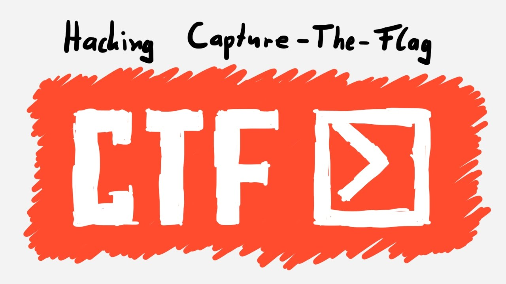

# CTF-BIBLE

##### tags `ctf` `web` `crypto` `reversing` `pwn` `forensics` `OSINT` 
## TL;DR 
### Writeups

- [Mobile](./Mobile)

- [Web](./Web)

- [Forensics](./forensics)

- [pwn](./pwn)

- [crypto](./crypto)

- [reversing](./reversing)

- [OSINT](./Osint)

### Archived CTFs 

- [Archive](https://github.com/sajjadium/CTFium)

# Introduction to CTFs

## What’s a CTF?
- A CTF (Capture the Flag) is a cybersecurity competition where players must “hack” their way through different challenges in order to retrieve a flag, which is then submitted for points, allowing them to climb up the leader board.
CTF Overview:
### Jeopardy:
- A set of different tasks, usually providing players with the freedom of choosing which challenge to start off with.
Jeopardy Main Categories:

#### Web Exploitation
- The player has to find and exploit vulnerabilities in a web application (XSS, SQLi, RCE, etc.)

#### Forensics
- Forensics is a key area of blue teaming and CTFs which includes aspects such as packet analysis, image analysis or in some cases location recovery.

#### Reverse Engineering
- RE mostly involves getting a compiled program and then deconstructing it into a far more readable format in order to get the flag.

#### Binary Exploitation(pwn)
- Binexp revolves around finding and exploiting vulnerabilities in programs, and get the flag. The best thing about binexp is that there are hundreds of possibilities and vulnerabilities to get the flag, be it through function modification, getting a shell or anything else.

#### Cryptography
- This category is in relation to finding some vulnerabilities within the overall cryptographic structure provided, be it RSA, AES, etc.

#### OSINT (Open-source intelligence)
- Making use of given data or clues and then taking into use Open source data online to investigate through the web in order to find the intended target.

#### Steganography
- This category usually contains revolves around finding hidden data within different forms of media, be it music, pictures, videos, etc.

#### Misc
Anything other than the mentioned categories, and the difficulty will always vary.

<a href="https://medium.com/bugbountywriteup/intro-to-ctfs-164a03fb9e60">Full Description</a>

# Where to Play CTFs
###### `Jeorpardies`

- <a href="https://ctftime.org">ctftime.org</a>
  - ctf events calendar and team ratings

- <a href="https://cybertalents.com">cybertalents.com</a>
  - beginner friendly ctf platform 
  
###### `Boot2root`

- [Hackthebox](https://hackthebox.eu)

- [Vulnhub](https://vulnhub.com)

- [Cyberspace](https://ctf.cyberspace.co.ke)

- [Tryhackme](https://tryhackme.com)

### more links

- [ctfsites](https://ctfsites.github.io)

### Similar Projects

- [CTF-NOTES](https://github.com/lanjelot/ctfs)

<b>Watch this Space for More XD</b>

