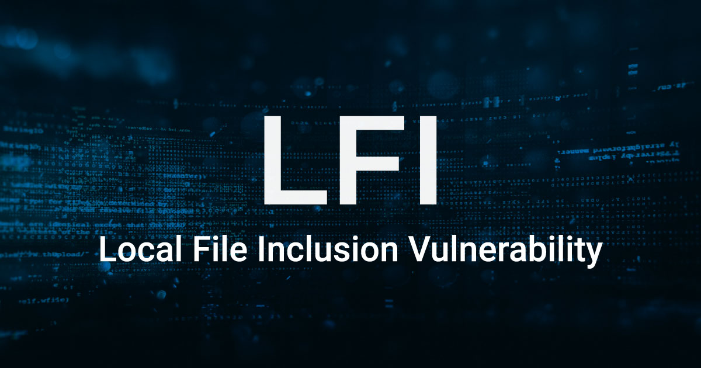

# File Inclusions (LFI/RFI)

## File Inclusion vulnerability 

- A file inclusion vulnerability is a type of web vulnerability that is most commonly found to affect web applications that rely on a scripting run time. This issue is caused when an application builds a path to executable code using an attacker-controlled variable in a way that allows the attacker to control which file is executed at run time. A file include vulnerability is distinct from a generic directory traversal attack, in that directory traversal is a way of gaining unauthorized file system access, and a file inclusion vulnerability subverts how an application loads code for execution. Successful exploitation of a file inclusion vulnerability will result in remote code execution on the web server that runs the affected web application. An attacker can use remote code execution to create a web shell on the web server, which can be used for website defacement. <a href="https://en.wikipedia.org/wiki/File_inclusion_vulnerability">Wikipedia</a>

  
CTF Writeups

## CTF Writeups

- [2013](#2013)

- [2014](#2014)

- [2015](#2015)

- [2016](#2016)

- [2017](#2017)

- [2018](#2018)

- [2019](#2019)

- [2020](#2020)

- [2021](#2021)

- [further-reading](#other-interesting-reads)

### 2013

- <a href="https://thehackerblog.com/hacking-xampp-web-servers-via-local-file-inclusion-lfi/">Hacking Xampp via lfi</a>

### 2014

- <a href="https://thehackerblog.com/hack-you-2014-ctf-writeup-winning-phpwning-web400-the-wrong-way/">phpwing web400</a>

- <a href="https://www.mrt-prodz.com/blog/view/2014/10/defcamp-ctf-quals-2014---web-300--pigeon-300pts-writeup">mrt-prodz : defcamp-quals ctf,pigeon</a>

### 2015

- <a href="https://insomnihack.ch/wp-content/uploads/2016/01/Hacking_like_in_the_movies.pdf">insomnihack 2015</a>

- <a href="https://www.internetwache.org/hacklu-ctf-2015-writeups-22-10-2015/">Hacklu 2015</a>

- <a href="https://0x1337seichi.wordpress.com/2015/03/15/codgate-2015-ctf-quals-owlur-writeup-web-200/">0x1337 : Codegate 2015</a>

- <a href="https://buer.haus/2015/09/20/csaw-2015-web-500-weebdate-writeup/">buer : csaw 2015 weeebdate</a>

- <a href="https://g0blin.co.uk/ekoparty-pre-ctf-2015-writeup/">g0blin : Ekoparty 2015</a>

### 2016

- <a href="https://www.megabeets.net/h4ck1t-2016-pentest-mexico/">Megabeets : h4ckit2016, Pentest-mexico</a>

- <a href="https://www.megabeets.net/twctf-2016-web-global-page/">Megabeets : TokyoWesterns2016, Global-page</a>

### 2017

- <a href="https://github.com/bl4de/ctf/blob/master/2017/ASIS_CTF_2017/Golem/Golem_Web_writeup.md">bl4de : Asis2017,Golem</a>

- <a href="https://aadityapurani.com/2017/09/17/csaw-ctf-2017-writeups/">aadityapurani : csaw2017</a>

- <a href="https://ethicalhackers.club/google-ctf-2017-quals-write/">google-ctf-2017 quals</a>

### 2018

- <a href="https://github.com/Pwn-Collective/CTF-writeups/tree/master/NeverLan-CTF-2018-writeup/Interweb/What-the-LFI">Pwn-Collective : NeverLanCTF What-the-LFI</a>

- <a href="https://thibaud-robin.fr/writeups/santhacklaus-2018/archdrive/">thibaud : santhacklaus-2018</a>

- <a href="https://github.com/flawwan/CTF-Writeups/blob/master/ritsec/archivr/writeup.md">flawwan : ritsec,Archivr</a>

- <a href="http://0xc0ffee.io/blog/ritsec-ctf-2018-archivr">0xc0ffee : Archivr</a>

- <a href="https://www.boiteaklou.fr/35C3-CTF-Writeups.html#junior-ctf-web---flags">boiteaklou : 35C3 junior,flags</a>

- <a href="http://apb.sh/b/writeups/accenture-ctf-greenland-web-challenge">apb : accenture-ctf-greenland-web</a>

- <a href="https://mrtaharamine.blogspot.com/2018/03/coingame-200-writeup-nuit-du-hack-ctf.html">mrtaharamine : coingame nuit-du-hack-ctf</a>

- <a href="https://netsecdaily.com/crossctf-2018-writeups/">netsecdaily : crossctf2018, The-Terminal</a>

- <a href="https://blog.orange.tw/2018/10/hitcon-ctf-2018-one-line-php-challenge.html">Orange : HITCON 2018,one-line-php</a>

### 2019 

- <a href="https://rawsec.ml/en/SecurinetsCTF-2019-Quals-write-up/">Rawsec : Securinets2019,Feedback</a>

- <a href="https://rawsec.ml/en/Sunshine-CTF-2019-write-ups/">Rawsec : Sunshine2019, Wrestler Name Generator</a>

- <a href="https://nytr0gen.github.io/writeups/ctf/2019/09/09/defcamp-ctf-quals-2019.html">nytrogen : Defcamp 2019,Imgur</a>

- <a href="https://www.aperikube.fr/docs/aperictf_2019/worldmeet/">Aperikube : aperictf,worldmeet </a>

- <a href="https://blog.harold.kim/2019/05/harekaze-ctf-2019-writeup">harold : harekaze-ctf 2019</a>

### 2020 

- <a href="https://www.youtube.com/watch?v=M8bg_Tge94k">Vietsec : TamuCTF2020 LFI to RCE</a>

- <a href="https://www.sousse.love/post/bugpoc-lfi-ctf-task/">Sousse.love : Bug POC lfi ctf task </a>	

- <a href="https://ironhackers.es/writeups/writeup-ctf-upsa-2020/">Ironhackers : Upsa 2020 </a>

- <a href="https://wrecktheline.com/writeups/ijctf-2020/">Wrecktheline : ijctf 2020 </a>

- <a href="https://st98.github.io/diary/posts/2020-04-27-ijctf-2020.html">st98 : ijctf 2020 </a>

- <a href="https://allen.gerysena.com/write-up-tjctf-file-viewer/">allen : tjctf 2020,file-viewer </a>

- <a href="https://blog.srikavin.me/posts/angstromctf-leettube/">srikavin : Angstromctf-leettube</a>

- <a href="https://blog.srikavin.me/posts/redpwnctf20-tux-fanpage/">srikavin : redpwnctf20 tux-fanpage</a>

- <a href="https://isopach.dev/Redpwn-CTF-2020/">Isopach : redpwnctf2020 tux-fanpage</a>

- <a href="https://grini25.tistory.com/169">Grini25 : Bsides-SF,had a bad day</a>

- <a href="https://securitythroughenlightenment.com/hacktivitycon-ctf-2020-web-writeups/">STE : hacktivitycon 2020</a>

- <a href="https://rgbsec.xyz/2020/04/21/sss-p2/">rgbsec : UMDctf,sss-p2</a>

- <a href="https://faizalhasanwala.me/2020-01-10-whitehat-writeup/">Faizal : Whitehat Quals</a>

### 2021 

- <a href="https://github.com/terawhiz/CTF-Writeups/tree/main/0x41414141-CTF/web/waffed#waffed---496-pts">terawhiz : 0x41414141,Waffed</a>

- [Maple Bacon,Lorem Ipsum.B0ilers CTF](https://ubcctf.github.io/2021/04/bo1lers-loremipsum/)

  
Other Interesting reads

#### other interesting reads 

- <a href="https://medium.com/@Aptive/local-file-inclusion-lfi-web-application-penetration-testing-cc9dc8dd3601">Aptive : LFI pentesting guide</a>

- <a href="https://owasp.org/www-project-web-security-testing-guide/latest/4-Web_Application_Security_Testing/07-Input_Validation_Testing/11.1-Testing_for_Local_File_Inclusion">OWASP : LFI Testing Guide</a>

- <a href="https://www.hackingarticles.in/comprehensive-guide-to-local-file-inclusion/">Raj Chandel : Comprehensive LFI Guide</a>

- <a href="https://rawsec.ml/en/local-file-inclusion-remote-code-execution-vulnerability/">Rawsec : LFI</a>

- <a href="https://raw.githubusercontent.com/tennc/fuzzdb/master/dict/BURP-PayLoad/LFI/LFI-WinblowsFileCheck.txt">Fuzzdb : LFi Winblows</a>

- <a href="https://github.com/D35m0nd142/LFISuite/blob/master/pathtotest_huge.txt">D35m0nd142 : LFISuite</a>

- <a href="https://ddxhunter.wordpress.com/2010/03/10/lfis-exploitation-techniques/">ddxhunter : lfi-exploitation-techniques</a>

- <a href="https://www.insomniasec.com/downloads/publications/LFI%20With%20PHPInfo%20Assistance.pdf">insomniasec : LFI with phpinfo assistance</a>

- <a href="https://dustri.org/b/from-lfi-to-rce-in-php.html">dustri : lfi to rce in php</a>

- <a href="https://xapax.gitbooks.io/security/local_file_inclusion.html">xapax : lfi</a>

- <a href="https://www.exploit-db.com/papers/12992/">ExploitDb : LFI paper</a>

- <a href="https://highon.coffee/blog/lfi-cheat-sheet">Highon.coffee : LFI cheatsheet</a>

- <a href="https://github.com/tennc/fuzzdb/blob/master/dict/BURP-PayLoad/LFI/LFI-FD-check.txt">Fuzzdb : LFI-FD check</a>

- <a href="http://securityidiots.com/Web-Pentest/LFI">Security Idiots : LFI</a>

