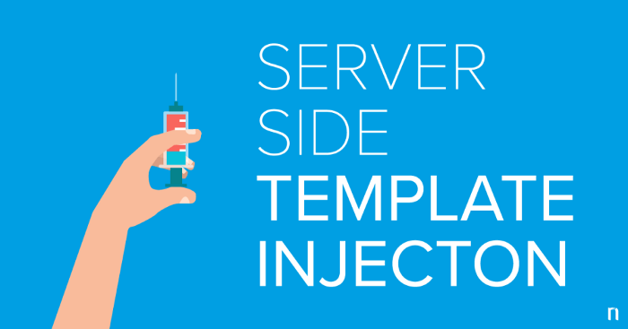

# SSTI

## What is SSTI ?

- Server-side template injection is when an attacker is able to use native template syntax to inject a malicious payload into a template, which is then executed server-side.

<a href="https://portswigger.net/web-security/server-side-template-injection">Portswigger Detailed explanation</a>

  
CTF-Writeups

## CTF-Writeups 

- [2017](#2017)

- [2018](#2018)

- [2019](#2019)

- [2020](#2020)

- [2021](#2021)

### 2017

- <a href="https://ctf-writeups.ru/2k17/asis-ctf-finals-2017/golem-is-stupid/">Golem is stupid, Asis2017</a>

### 2018 

- <a href="https://medium.com/bugbountywriteup/angstromctf-2018-web-writeups-part-2-6c1ee586aa64">Abdelkader Belcaid : AngstromCTF 2018, Madlibs</a>

- <a href="https://medium.com/bugbountywriteup/tokyowesterns-ctf-4th-2018-writeup-part-3-1c8510dfad3f">Abdelkader Belcaid
: Tokyowesterns 2018,Shrine</a>

- <a href="https://ctftime.org/writeup/11014">kazkiti :  HackIT CTF 2018,Believers Case</a>

- <a href="https://s0cket7.com/picoctf-web/">s0cket7 : picoctf _flask cards_ </a>

### 2019

- <a href="https://medium.com/bugbountywriteup/x-mas-2019-ctf-write-up-mercenary-hat-factory-ssti-53e82d58829e">Slamat : X-MAS 2019 CTF write-up (Mercenary Hat Factory) SSTI</a>

- <a href="https://hell38vn.wordpress.com/2019/03/05/tamu-ctf2019-science-web/">hell38vn : tamuctf2019 Science</a>

- <a href="https://nytr0gen.github.io/writeups/ctf/2019/09/09/defcamp-ctf-quals-2019.html">nytrogen : defcamp quals 2019,Movie Night</a>

- <a href="https://redpwn.net/writeups/picoctf2019/empire2/">redpwn : picoctf _empire2_</a>

### 2020 

- <a href="https://github.com/team0se7en/CTF-Writeups/blob/master/csictf2020/web/The_Usual_Suspects/README.md">team0se7en : csictf2020, Usual suspects</a>	

- <a href="https://hackerone.com/reports/895778">nirvana_msu : [H1-2006] CTF Writeup</a>

- <a href="https://noxtal.com/writeups/2020/08/02/hacktivitycon-template-shack/">noxtal : hacktivitycon,template-shack</a>

- [bootplug : http for pros,defcamp](https://github.com/bootplug/writeups/blob/master/2020/defcamp/writeups.md#http-for-pros)

- [st98 : Notes,hexion](https://st98.github.io/diary/posts/2020-04-13-hexion-ctf-2020-online.html#web-881-notes-37-solves)

### 2021 

- [guyintheshell : maze,0x41414141](https://www.youtube.com/watch?v=YA8wcG1GL8A)

- [luftenshjaltar : maze,0x41414141](https://luftenshjaltar.info/writeups/0x41414141ctf/web/maze/)

- [Sqrtrev : DMM,DarkCON](https://vuln.live/blog/12)

- [beerpwn : Localization is hard(thymeleaf SSTI),AerpCTF](https://beerpwn.github.io/ctf/2021/aero_CTF/web/Localization_is_hard/)

- [n4sm : Localization is hard,AeroCTF](https://ret2school.github.io/post/localization_is_hard_wu/)

  
other interesting reads

### other interesting reads 

- <a href="https://we45.com/blog/server-side-template-injection-a-crash-course/">we45 : SSTI Crash Course</a>

- <a href="https://portswigger.net/research/server-side-template-injection">Portswigger : SSTI Research</a>

- <a href="https://book.hacktricks.xyz/pentesting-web/ssti-server-side-template-injection">Hacktricks : SSTI</a>

- <a href="https://musyokaian.medium.com/server-side-template-injection-ssti-afa201f2afbb">Musyoka Ian : SSTI explanation</a>

- <a href="https://www.onsecurity.io/blog/server-side-template-injection-with-jinja2/">onsecurity SSTI with jinja2</a>

- <a href="https://medium.com/@nyomanpradipta120/ssti-in-flask-jinja2-20b068fdaeee">SSTI in flask/jinja2</a>

- <a href="https://blog.cobalt.io/a-pentesters-guide-to-server-side-template-injection-ssti-c5e3998eae68">cobalt : pentesters guide to SSTI</a>

- <a href="https://pequalsnp-team.github.io/cheatsheet/flask-jinja2-ssti">SSTI : cheatsheet</a>

- <a href="https://0x1.gitlab.io/web-security/Server-Side-Template-Injection/">0x1 : SSTI</a>

- <a href="https://github.com/swisskyrepo/PayloadsAllTheThings/tree/master/Server%20Side%20Template%20Injection#jinja2">PayloadAllTheThings : SSTI</a>

- [Jinja2 SSTI Filter bypass](https://medium.com/@nyomanpradipta120/jinja2-ssti-filter-bypasses-a8d3eb7b000f)

- [0day : JInja2 template injection filter bypasses](https://0day.work/jinja2-template-injection-filter-bypasses/)

- [acunetix : exploiting ssti in thymeleaf](https://www.acunetix.com/blog/web-security-zone/exploiting-ssti-in-thymeleaf/)

- [veracode : Spring-view manipulation vulnerability](https://www.veracode.com/blog/secure-development/spring-view-manipulation-vulnerability)

- [Hacktricks : thymeleaf java SSTI](https://book.hacktricks.xyz/pentesting-web/ssti-server-side-template-injection#thymeleaf-java)

  
Youtube Videos

  
### Youtube Videos 

- <a href="https://www.youtube.com/watch?v=SN6EVIG4c-0">Pwnfunction : SSTI Explained</a>

- <a href="https://www.youtube.com/watch?v=WNo0GJl0Keo">Sam : SSTI</a>

- <a href="https://www.youtube.com/watch?v=jRiz8Yg9vbA">Cobalt : SSTI all-in-one</a>

