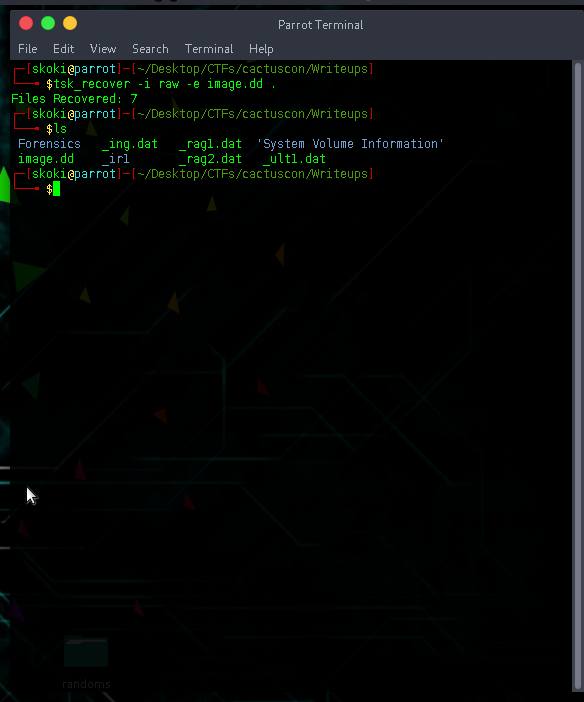
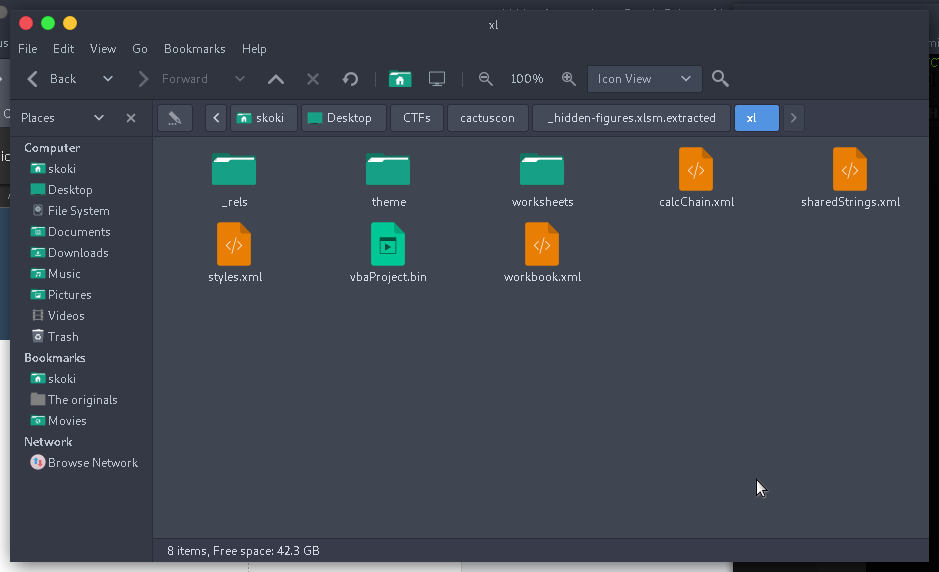
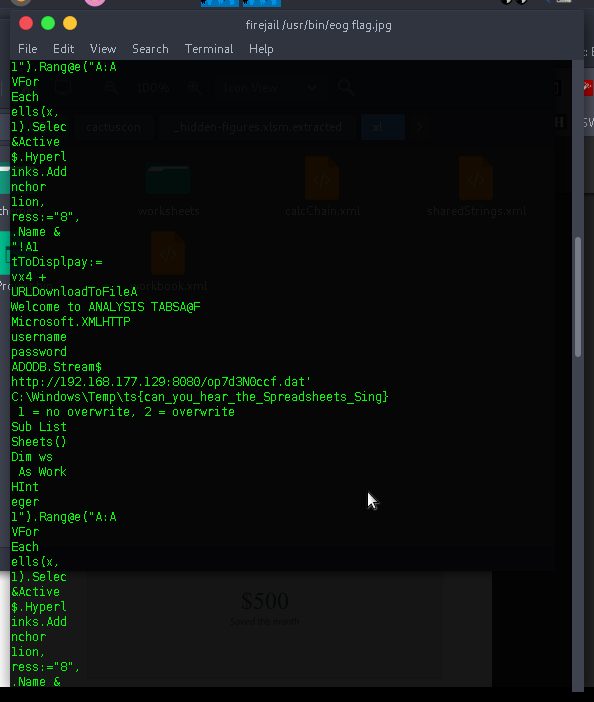

# The Sleuth Fairy
###### tags: `ctf` `cactuscon` `forensics` 
##### solves 11
### Challenge Description
I accidentally deleted an important file. I have attached the disk image. Can you recover the deleted file `fragments` for me?

<a href="https://drive.google.com/file/d/1HLK47KOuw4Ki3puPraupbU-gOsZBsijn/view?usp=sharing">File</a>

### Solution 
for this solution i used The Sleuth Kit, and specifically the tool tsk_recover
this was recommended by a teammate,
thats after foremost and binwalk failed me ...
...
```tsk_recover -i raw -e image.dd .```
using the above command on challenge file we got 7 recovered files...
but no flag yet ... 


but wait we can see `_rag1.dat, _rag2.dat` fragmented chunks as per the challenge description 
and we all get a third one `frag3.dat` from _ir1,dir2_ folders ... 
 
a close look at `_rag1.dat` reveals it to be a corrupt jpeg image
....
strings confirms it 
```
$strings _rag1.dat 
JFIF
(ICC_PROFILE
mntrRGB XYZ 
acsp
	desc
trXYZ
gXYZ
```

the 3 fragmnents together will reveal the flag ... 

```
base64 < _rag1.dat > frag1.txt
base64 < _rag2.dat > frag2.txt
base64 < frag3.dat > frag3.txt
```

appending all the txt files together and decoding recovers the image with the flag 
`cat frag.txt frag2.txt frag3.txt > final.txt`

`cat final.txt | base64 -d > flag.jpg`

recovers the image plus a visible flag


> flag : {santiano_the_drunk_punching_bag}


# Yeehaw
##### points : 30 Solves : 30

### Challenge Description

We recovered a planning document from an APT. We think they might have `hidden a file` in this document.

<a href="https://drive.google.com/file/d/1FQbC5BumZwve9b0YvQzX1AiZU6AlCqTv/view?usp=sharing">Yeehaw</a>


### solution 
our goal was to recover an embedded file 

`7z x plan.docx` was our first option but that failed 

`binwalk -Me plan.docx`

we get our flag under 
> theme 2 extracted 


> flag : {gabe_pls_wall3t}

PS

<a href="https://medium.com/@migokedem/malware-embedded-in-microsoft-office-documents-dde-exploit-macroless-4f197387ddbd">https://medium.com/@migokedem/malware-embedded-in-microsoft-office-documents-dde-exploit-macroless-4f197387ddbd</a>

<a href="https://zeltser.com/malicious-code-inside-office-documents">https://zeltser.com/malicious-code-inside-office-documents</a>

# Hidden Figures
### points 50 solves:44

### challenge Desscription

One of our analysts downloaded this spreadsheet from a `phishing attachment`. Can you find the `malicious payload`?

<a href="https://drive.google.com/file/d/1DA4TNvVIItGLQy02E6IkEhOT0-MdOxS3/view?usp=sharing">hidden</a>

### solution

we extracted the files using binwalk oncemore getting a suspicious `vbaProject.bin` file 

runnings strings on it revealed the flag 




> flag : ts{can_you_hear_the_Spreadsheets_Sing}


further reads :

<a href="https://www.zdnet.com/article/microsoft-beware-this-massive-phishing-campaign-using-malicious-excel-macros-to-hack-pcs/">https://www.zdnet.com/article/microsoft-beware-this-massive-phishing-campaign-using-malicious-excel-macros-to-hack-pcs/</a>

<a href="https://digit.fyi/microsoft-warns-of-huge-phishing-campaign-using-microsoft-excel/">https://digit.fyi/microsoft-warns-of-huge-phishing-campaign-using-microsoft-excel/</a>


thank you for taking time to read
for questions and clarifications contact me on twitter 
<a href="https://twitter.com/k0imet_">@k0imet_</a>
