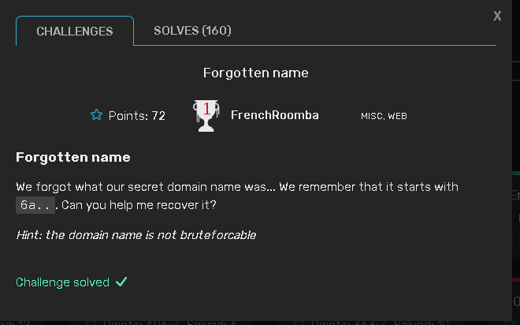

# Forgotten name
Web/Misc
Solves 160
## Challenge

## Solution

This was a rather interesting challenge,an asset discovery challenge.
wasted alot of time on it because i was working on the wrong domain .justctf.team which was not the target domain, 
reading the description again the challenge is under ``web`` category to which all the other challenges used a different ``*.jctf.pro`` 
with the domain as now our target 
i decided to use ``subfinder`` to enumerate subdomains hosted on that domain 

following the link starting with 6a....

<a href="6a7573744354467b633372545f6c34616b735f6f3070737d.web.jctf.pro">challenge</a>

hmmm! no flag yet! 

looking again at the domain name,i decided to decode the hex to text using CyberChef 
and we get the flag 

....
and there's our flag 
###justCTF{c3rT_l4aks_o0ps}

you can use <a href="crt.sh">crt.sh</a> to get the domain
