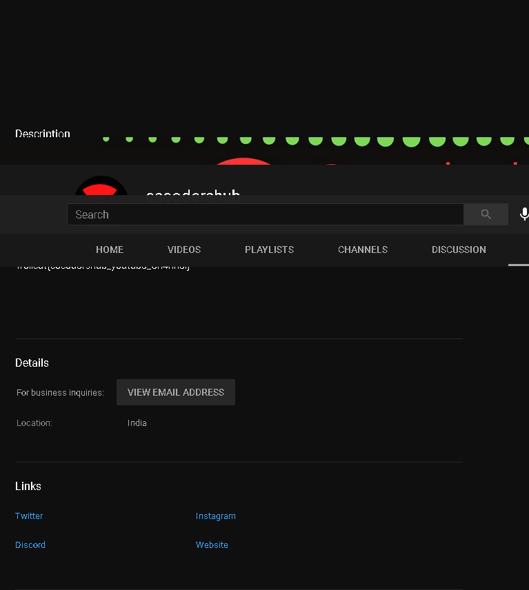

# Sanity Check

## points 50
###### tags: `ctf` `Trollcat` `misc` `shadow`
Sample Flag: 
> Trollcat{Y0u_ar3_s4ne}

### solution 

> flag : Trollcat{Y0u_ar3_s4ne}

# Social Challenge
### points 100

### Challenge Description 
Explore us more. 
Flag Format: 
Trollcat{} 
Author: MrGrep

### solution 
the flag was on youtube 


> flag : Trollcat{c5c0d3rshub_y0utub3_Ch4nn3l}

# Rich Orphan
### points 100

### challenge description
Some rich orphan left me this file, find me the password !
<a href="https://cdn.discordapp.com/attachments/782656136976662539/807551386505969684/RichOrphan.txt">challenge</a>
Flag format: 
Trollcat{flag}

### solution 

```
cat RichOrphan.txt 

sys:$1$fUX6BPOt$Miyc3UpOzQJqz4s5wFD9l0:14742:0:99999:7:::
sys:x:3:3:sys:/dev:/bin/sh
```
we get both 
> /etc/passwd and /etc/shadow

separated them into two different files 

then unshadowed to get
```sys:$1$fUX6BPOt$Miyc3UpOzQJqz4s5wFD9l0:3:3:sys:/dev:/bin/sh```

which we later use john to crack the hash 

```john --wordlist=/usr/share/wordlists/rockyou.txt hash```

and we get our password 
> batman 

>flag: Trollcat{batman}

<a href="https://erev0s.com/blog/cracking-etcshadow-john/">Readmore</a>
